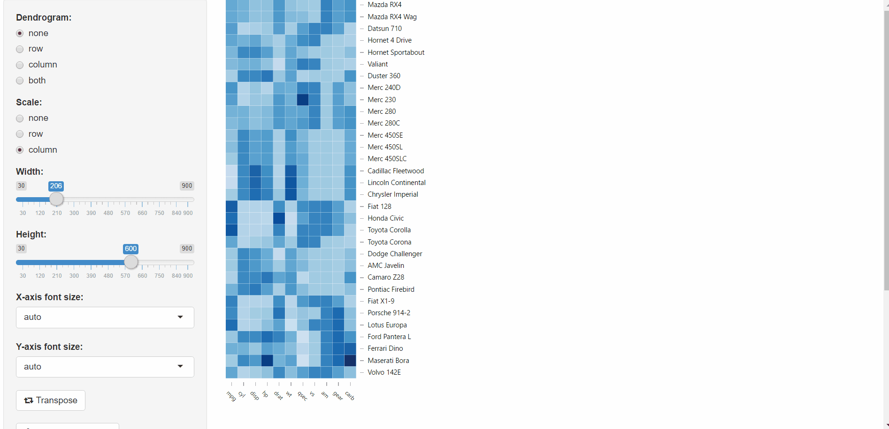

# d3HeatmapMod
A shiny module for d3heatmap plot

### Introduction

This is a d3heatmap packages based shiny module that provide plot control UI and heatmap output


### Pre-request

This shiny module requires following packages. Please make sure they are installed.

```r
install.package('d3heatmap')
install.package('RColorBrewer')
```
### Usage

1. Source the module file

  ```r
  source('d3HeatmapMod.R')
  ```
  
2. Invoke module in server function. Make sure to set appropriate parameters.

  ```r
  server <- function(input, output, session) {

    callModule(d3HeatmapMod, id = 'YOU_MODULE_ID', 
               data = reactive({mtcars}), # A numeric matrix to display (wrapped as a reactive object)
               dendrogram = reactive(NULL), # One of "none"(default), "row", "column" or "both" (wrapped as a reactive object)
               scale = reactive({'column'})) # One of "none"(default), "row" or "column" (wrapped as a reactive object)
  
    # other codes

  }
  ```
  
3. Add control ui and heatmap output

  ```r
  ui <- fluidPage(

    sidebarLayout(

      sidebarPanel(
        width = 3,
        d3HeatmapControl('YOU_MODULE_ID')
      ),

      mainPanel(
        width = 9,
        d3HeatmapPlot('YOU_MODULE_ID')
      )
      
    )

  )
  ```

4. Run app and use control ui to adjust the appearance of the heatmap


